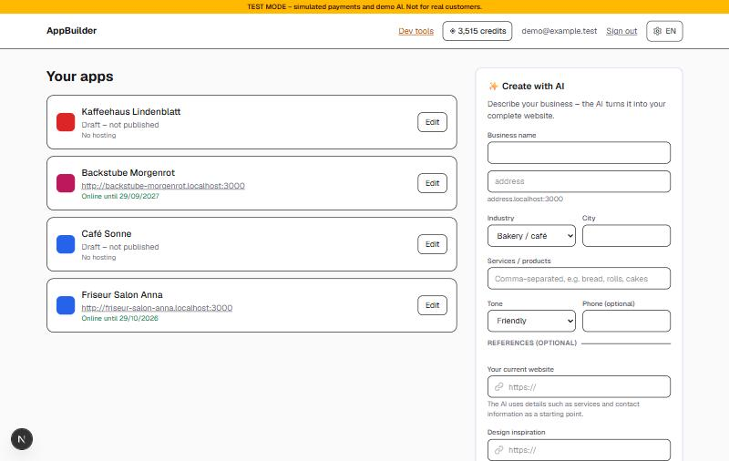
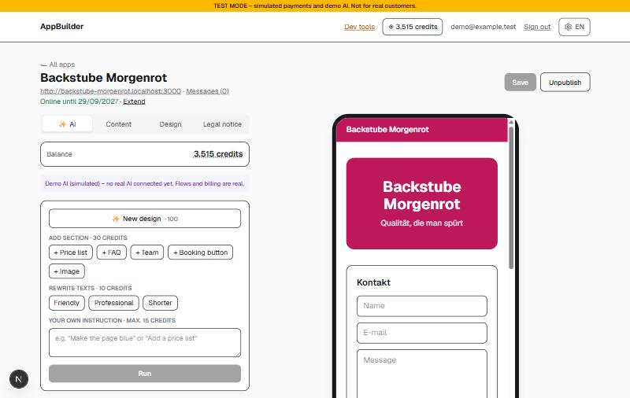
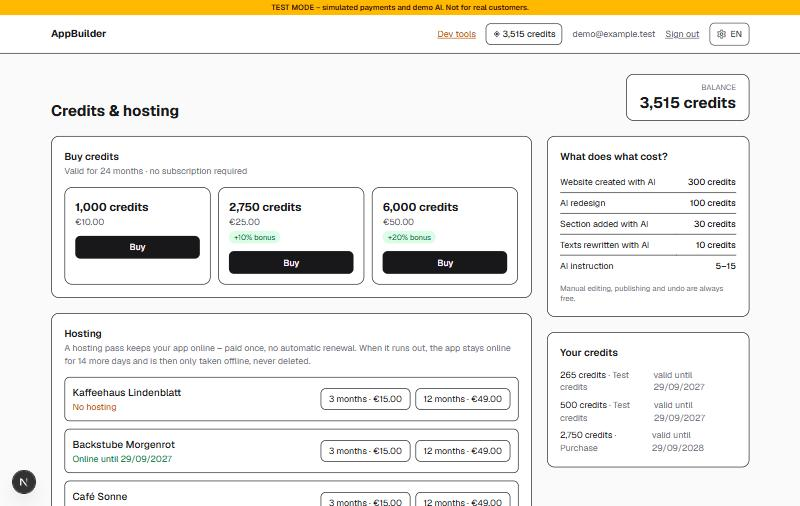
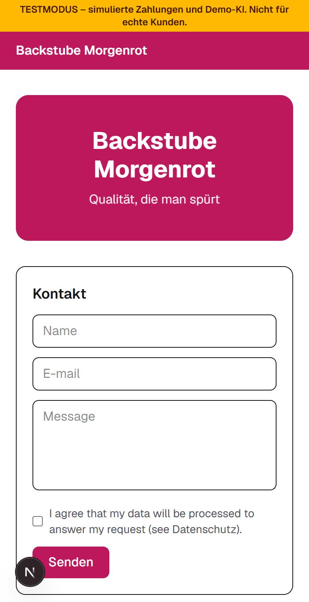
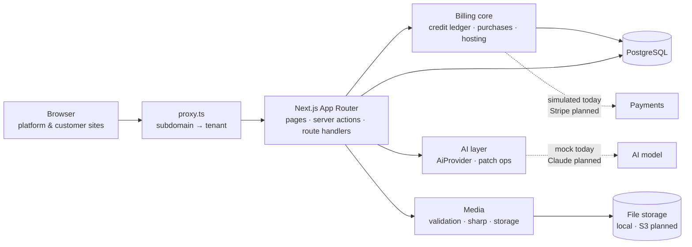

<div align="center">

# AppBuilder

**An open-source, AI-assisted no-code builder for small-business websites and installable web apps (PWAs).**

Self-employed people and small businesses describe their business, get a complete website generated in seconds,
refine it by chatting with an AI, and publish it on their own subdomain – GDPR-friendly and hosted in the EU.

[](https://github.com/BailinZheng/appbuilder/actions/workflows/ci.yml)
[](LICENSE)


[Features](#features) · [Screenshots](#screenshots) · [Quick start](#quick-start) · [Architecture](#architecture) · [Roadmap](#roadmap) · [Contributing](#contributing)

</div>

---

> **Status: early development (pre-alpha).** The full product flow works end to end locally. The AI model and the
> payment provider are still replaced by clearly separated stand-ins (a deterministic mock AI and a simulated checkout)
> behind production-ready interfaces – see [Roadmap](#roadmap).

## Features

**For business owners**

- ✨ **Create with AI** – a short guided form (business, industry, services, tone, optional reference websites) produces a complete site
- 💬 **Edit with AI** – one-click redesigns, new sections, text rewrites or free-form instructions; every AI change can be **undone for free**
- 🧩 **Block editor** – header, text, images, buttons, opening hours and contact forms with a live phone preview
- 🖼️ **Drag & drop images** – automatically resized, converted to WebP and stripped of metadata such as GPS location
- 📱 **Installable PWA** for every site – own subdomain, generated icon, web manifest and offline support
- ⚖️ **German legal basics built in** – required Impressum before publishing, privacy-policy template, consent on contact forms
- 🌍 **German & English UI**, switchable at any time (German is the default)

**Under the hood**

- 🏢 **Multi-tenant by design** – one codebase serves the platform and all customer sites (`<slug>.your-domain`)
- 💳 **Pay-as-you-go credit ledger** – reserve → capture/release in a single transaction, row-locked against double spending, expiring credit lots, append-only history and a verified ledger invariant
- 🏠 **Hosting passes** without subscriptions – 14-day grace period, sites go offline but are never deleted
- 🔌 **Swappable providers** for AI, payments and file storage – mock/dev implementations today, real ones without redesign
- 🛡️ **Security-minded** – tenant isolation on every query, XSS-safe link validation, content-based upload type detection, SSRF-safe reference URLs, security headers
- ✅ **Tested** – 29 automated tests on a real PostgreSQL (concurrency, refunds, idempotency, upload safety …) and CI on every push

## Screenshots

| Dashboard & “Create with AI” | Editor with AI panel and live preview |
|---|---|
|  |  |
| **Credits & hosting** | **Published site on a phone** |
|  |  |

<sub>Screenshots show the local development build with demo data; the yellow banner marks test mode.</sub>

## Tech stack

| Layer | Technology |
|---|---|
| Framework | [Next.js 16](https://nextjs.org) (App Router, Server Actions, `proxy.ts`) · React 19 · TypeScript (strict) |
| Styling | Tailwind CSS 4 |
| Database | PostgreSQL · [Drizzle ORM](https://orm.drizzle.team) with versioned SQL migrations |
| Auth | [Better Auth](https://www.better-auth.com) – self-hosted e-mail/password, telemetry disabled |
| Validation | Zod 4 |
| Images | sharp (resize, rotate, WebP, metadata stripping) |
| Testing | Node.js test runner + tsx against a dedicated test database |
| CI | GitHub Actions (lint, typecheck, tests with PostgreSQL, production build) |

## Quick start

**Prerequisites:** Node.js 24 LTS and PostgreSQL 16+ (local install or Docker).

```bash
git clone https://github.com/BailinZheng/appbuilder.git
cd appbuilder
npm install
cp .env.example .env
```

Create the databases (adjust user and password), then put the same values into `.env`:

```bash
createdb appbuilder
createdb appbuilder_test
```

Generate an auth secret and paste it into `BETTER_AUTH_SECRET`:

```bash
openssl rand -base64 32
```

Start the app – migrations run automatically:

```bash
npm run dev
```

| URL | What |
|---|---|
| http://localhost:3000 | Platform: sign up, dashboard, editor |
| `http://<slug>.localhost:3000` | A published customer site (also at `/s/<slug>`) |
| http://localhost:3000/dev | Developer tools: grant test credits, unit economics (when `ENABLE_DEV_TOOLS=true`) |

To try the full flow: sign up, grant yourself test credits on `/dev`, then use **Create with AI** on the dashboard.

<details>
<summary><b>Configuration (.env)</b></summary>

| Variable | Required | Description |
|---|---|---|
| `DATABASE_URL` | yes | PostgreSQL connection string |
| `BETTER_AUTH_SECRET` | yes | Random 32-byte secret for signing sessions |
| `BETTER_AUTH_URL` | yes | Public URL of the platform, e.g. `http://localhost:3000` |
| `ROOT_DOMAIN` | yes | Domain whose subdomains are customer sites (`localhost` in development) |
| `TEST_DATABASE_URL` | for tests | Separate database used by `npm test` |
| `ENABLE_DEV_TOOLS` | no | `true` enables `/dev`, test credits and the simulated checkout. **Never in production.** |
| `AI_PROVIDER` | no | `mock` (default). `anthropic` is planned. |
| `PAYMENT_PROVIDER` | no | `dev` (simulated checkout, default). `stripe` is planned. |
| `MEDIA_STORAGE` / `MEDIA_DIR` | no | `local` file storage in `./data/uploads` (default). S3-compatible storage is planned. |
| `MOCK_AI_LATENCY_MS` | no | Simulated AI response time for the mock provider |

</details>

### Scripts

| Command | Description |
|---|---|
| `npm run dev` | Apply migrations and start the dev server |
| `npm run build` / `npm start` | Production build (standalone output, Docker-ready) / run it |
| `npm test` | Run the test suite against `TEST_DATABASE_URL` |
| `npm run lint` · `npm run typecheck` | ESLint · TypeScript |
| `npm run db:generate` · `npm run db:migrate` | Create a migration from `src/db/schema.ts` · apply migrations |
| `npm run db:studio` | Browse the database |
| `npm run dev:grant-credits -- <email> <amount>` | Grant test credits (dev tools only) |

## Architecture



Key design decisions:

- **Sites are data, not generated code.** Every customer site is a small, validated JSON document of blocks rendered
  by one shared engine. AI output stays small and cheap, every change is reviewable, and there is no untrusted code to host.
- **AI edits are patches.** The model returns operations (`add_block`, `update_block`, `set_theme` …) that are
  validated before they are applied – the same schema will become strict tool definitions for the real model.
- **Charge if and only if the user gets the result.** Credits are reserved first; the charge and the saved result
  are committed in one database transaction, and failures release the reservation automatically.

More detail – data model, billing invariants, upload pipeline, i18n and how to replace each stand-in – is in
**[docs/ARCHITECTURE.md](docs/ARCHITECTURE.md)**.

### Project structure

```
src/
├── app/
│   ├── (auth)/          sign-in / sign-up
│   ├── dashboard/       apps, AI form, editor, messages, credits & hosting
│   ├── s/[slug]/        public customer sites: page, legal pages, PWA manifest & icon
│   ├── dev/             developer tools and simulated checkout (ENABLE_DEV_TOOLS)
│   ├── api/             auth and media upload endpoints
│   └── media/           public image delivery
├── components/          AppRenderer, ImageDropzone, SettingsMenu, …
├── db/                  Drizzle schema and client
├── i18n/                German/English dictionaries and helpers
├── lib/
│   ├── ai/              provider interface, mock AI, patch operations, pricing
│   ├── billing/         price catalog, credit ledger, purchases, hosting
│   └── media/           image validation, processing, storage
└── proxy.ts             multi-tenant subdomain routing
drizzle/                 SQL migrations
tests/                   automated tests
```

## Roadmap

- [x] Multi-tenant block editor with live preview, PWA output and subdomains
- [x] German/English platform UI
- [x] Pay-as-you-go credit ledger, hosting passes, simulated checkout
- [x] AI actions behind a provider interface (mock implementation)
- [x] Drag & drop image uploads with privacy-preserving processing
- [ ] Claude integration (structured output, strict patch tools, prompt caching, web fetch for reference sites)
- [ ] Stripe Checkout and webhooks
- [ ] Free AI preview with quotas and abuse protection
- [ ] E-mail verification, password reset and hosting-expiry reminders
- [ ] S3-compatible media storage and cleanup of unused files
- [ ] Per-site language setting for customer sites
- [ ] PostgreSQL row-level security as a second layer of tenant isolation
- [ ] Docker image and one-click deployment (e.g. Coolify on Hetzner)

## Contributing

Contributions, bug reports and ideas are welcome! Please read **[CONTRIBUTING.md](CONTRIBUTING.md)** and the
**[Code of Conduct](CODE_OF_CONDUCT.md)** first. For security issues, please follow **[SECURITY.md](SECURITY.md)**
instead of opening a public issue.

## License

AppBuilder is licensed under the **[GNU Affero General Public License v3.0](LICENSE)** (AGPL-3.0-or-later).
You may use, study, modify and share it. If you run a modified version as a network service, you must make your
modified source code available to its users under the same license.

Copyright © 2026 Bailin Zheng
